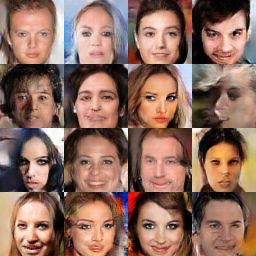

# GANs comparison without cherry-picking

Implementions of some theoretical generative adversarial nets: DCGAN, EBGAN, LSGAN, WGAN, WGAN-GP, BEGAN, and DRAGAN. 

I implemented the structure of model equal to the structure in paper and compared it on the CelebA dataset.


[TOC]

## Features

- Model structure is copied from each paper
    - But some details are ignored
    - I admit that a little details make great differences in the results due to the very unstable GAN training
- No hard tuning for each model - so the results can be improved
- Well-structured - was my goal at the start, but the result is not satisfactory :(
    - TensorFlow queue runner is used for inpue pipeline
    - Single trainer (and single evaluator) - multi model structure
    - Logs in training and configuration are recorded on the TensorBoard

## Models

- DCGAN
- LSGAN
- WGAN
- WGAN-GP
- EBGAN
- BEGAN
- DRAGAN

The family of conditional GANs are excluded (CGAN, acGAN, SGAN, and so on).

## Dataset 

### CelebA

http://mmlab.ie.cuhk.edu.hk/projects/CelebA.html

- All experiments were performed on 64x64 CelebA dataset
- The dataset has 202599 images
- 1 epoch consists of about 15.8k iterations for batch size 128

## Results

- I implemented the same as the proposed model in each paper, but ignored some details (or the paper did not describe details of model)
  - For example, I used all weight initialization as default which is xavier init
- Default batch_size=128 and z_dim=100 (from DCGAN)

### DCGAN

- Relatively simple networks
- Learning rate for discriminator (D_lr) is 2e-4

|                G_lr=2e-4                 |                G_lr=1e-3                 |
| :--------------------------------------: | :--------------------------------------: |
|                   50k                    |                   30k                    |
|  |  |

Higher learning rate for generator makes better results. I used G_lr=1e-3 and D_lr=2e-4 which is the same as the paper suggested. In this case, however, the generator has been collapsed sometimes due to its large learning rate. Lowering both learning rate can bring stability like https://ajolicoeur.wordpress.com/cats/ in which suggested D_lr=5e-5 and G_lr=2e-4.

### EBGAN

- I like energy concept, so this paper also very interesting
  - But EBGAN is not a more energy-based model: [Are Energy-Based GANs any more energy-based than normal GANs?](http://www.inference.vc/are-energy-based-gans-actually-energy-based/)


- Anyway, the energy concept and autoencoder based loss function are impressive personally, and the results are also good
- But I have a question for Pulling-away Term (PT), which prevents mode-collapse
- Theoretically, the role of PT is to prevent mode-collapse


|             pt weight = 0.1              |                No pt loss                |
| :--------------------------------------: | :--------------------------------------: |
|                   30k                    |                   30k                    |
|  |  |

The model using PT generates slightly better sample visually. However, the results does not seem to prevent mode-collapse.


|             pt weight = 0.1              |                No pt loss                |
| :--------------------------------------: | :--------------------------------------: |
|  |  |

pt_loss decreases faster in the left which used pt_weight=0.1 but there is no big difference and even at the end the right which used no pt_loss has a lower pt_loss. So I wonder: what is real role of PT loss?

### LSGAN

- Unusually, LSGAN used large dimension for latent space (z_dim=1024)
- But in my experiments, z_dim=100 makes better results than z_dim=1024 which is originally used in paper

|                z_dim=100                 |                z_dim=1024                |
| :--------------------------------------: | :--------------------------------------: |
|                   30k                    |                   30k                    |
|  |  |


### WGAN

- WGAN is very theoretical paper, so the results are not impressive (but the theory is very impressive!)
- Also no specific network structure proposed, so DCGAN architecture was used for experiments

|               30k                |               W distance               |
| :------------------------------: | :------------------------------------: |
|  |  |


### WGAN-GP

- I tried two network architectures, which are DCGAN architecture and ResNet architecture in appendx C
- ResNet has more complicated architecture and better performance than DCGAN architecture
- resnet 결과가 더 좋은데 기대만큼의 성능향상이 나오지는 않음
  - 특이한 점은 굉장히 빨리 수렴하고 더 학습하면 결과가 나빠짐
  - skip-connection 의 영향으로 보임
- DRAGAN 논문에서는 WGAN(-GP) 의 constraint 가 너무 restrict 해서 poor G 를 학습한다고 함
- wgan-gp 는 에퐄이 올라가면 얼굴이 뭉개지는 현상이 있는데, 이는 w_dist 가 예쁘게 떨어지는 것과 상반됨
  - Q. 왤까?

wgan-gp.dcgan vs. wgan-gp.resnet

|            DCGAN architecture            |           ResNet architecture            |
| :--------------------------------------: | :--------------------------------------: |
|                   30k                    |           7k, batch size = 64            |
|  |  |

wgan-gp.dcgan 은 에퐄이 올라가면 얼굴이 뭉개지는 현상이 있음

|                   10k                    |                   20k                    |                   30k                    |
| :--------------------------------------: | :--------------------------------------: | :--------------------------------------: |
|  |  |  |


wgan-gp.resnet 도 비슷함

|                    5k                    |                    7k                    |                   10k                    |                   15k                    |
| :--------------------------------------: | :--------------------------------------: | :--------------------------------------: | :--------------------------------------: |
|  |  |  |  |
|                   20k                    |                   25k                    |                   30k                    |                   40k                    |
|  |  |  |  |

그래프는 이쁘게 떨어짐

|            DCGAN architecture            |           ResNet architecture            |
| :--------------------------------------: | :--------------------------------------: |
|  |  |
|  |  |

W_dist < 0 이 되는게 흥미로운데, discriminator 를 generator 가 압도하고 있다고 볼 수 있음. E[fake] > E[real]. n_critic 을 늘려야 하나?


### BEGAN

- celebA 에 대해서는 결과가 좋음 (사람이 보기에)
  - optional improvement 부분은 구현하지 않았음에도!
- 그러나 디테일이 없어지는듯한 느낌이 있음
- Q. LSUN 등 다른 데이터셋에 대해서도 결과가 잘 나올까? - ToDo

batch size = 16, z_dim=64, gamma=0.5

|                30k                 |                50k                 |                75k                 |
| :--------------------------------: | :--------------------------------: | :--------------------------------: |
|  |  |  |

|     Convergence measure M      |
| :----------------------------: |
|  |


### DRAGAN

- Game theory 에서의 접근이 굉장히 흥미로움
- DCGAN architecture
- 동일한 아키텍처인 DCGAN, WGAN, WGAN-GP 와 비교해봤을 때 결과가 좋음
  - hyperparam tuning 한 DCGAN 과는 비슷한 느낌
- 특히 WGAN-GP 와 알고리즘이 비슷 (WGAN-GP + DCGAN 느낌)
- 논문에 따르면 WGAN-GP 는 restriction 이 너무 강하여 poor G 를 생성한다고 함

|          DCGAN architecture          |
| :----------------------------------: |
|                 30k                  |
|  |


## Conclusion

- BEGAN이 제일 인상적이긴 하나 LSUN 에서도 그럴지 궁금
  - BEGAN 은 learning rate decay 등등 implementation 자체가 신경써서 되어 있기는함 - 즉 엔지니어링빨이라고 할수도
  - 그렇다 쳐도 결과가 매우 인상적
- DCGAN도 learning rate 을 잘 조절해주면 좋은 결과를 보임
  - BEGAN 을 제외하고 제일 좋은 결과인 것 같기는 한데 다른 모델들은 tuning 을 전혀 안했기때문에 무조건 그렇다고 할 순 없음
- DRAGAN 도 꽤나 인상적

## Usage

Download CelebA dataset:

```
$ python download.py celeba
```

Convert images to tfrecords format:

```
$ python convert.py
```

Train:

```
$ python train.py --help
usage: train.py [-h] [--num_epochs NUM_EPOCHS] [--batch_size BATCH_SIZE]
                [--num_threads NUM_THREADS] --model MODEL [--name NAME]
                [--renew]

optional arguments:
  -h, --help            show this help message and exit
  --num_epochs NUM_EPOCHS
                        default: 20
  --batch_size BATCH_SIZE
                        default: 128
  --num_threads NUM_THREADS
                        # of data read threads (default: 4)
  --model MODEL         DCGAN / LSGAN / WGAN / WGAN-GP / EBGAN / BEGAN /
                        DRAGAN
  --name NAME           default: name=model
  --renew               train model from scratch - clean saved checkpoints and
                        summaries
```

Monitor through TensorBoard:

```
$ tensorboard --logdir=summary/name
```

Evaluate (generate fake samples):

```
$ python eval.py --help
usage: eval.py [-h] --model MODEL [--name NAME]

optional arguments:
  -h, --help     show this help message and exit
  --model MODEL  DCGAN / LSGAN / WGAN / WGAN-GP / EBGAN / BEGAN / DRAGAN
  --name NAME    default: name=model
```

### Requirements

- python 2.7
- tensorflow 1.2
- tqdm
- (optional) pynvml - for auto gpu selection


### Similar works

- [wiseodd/generative-models](https://github.com/wiseodd/generative-models)
- [hwalsuklee/tensorflow-generative-model-collections](https://github.com/hwalsuklee/tensorflow-generative-model-collections)
- [sanghoon/tf-exercise-gan](https://github.com/sanghoon/tf-exercise-gan)
- [YadiraF/GAN_Theories](https://github.com/YadiraF/GAN_Theories)
- https://ajolicoeur.wordpress.com/cats/


## ToDo

- LSUN dataset
- flexible input shape
- modulation of D/G networks
- Other models - CramerGAN, GoGAN, etc ...